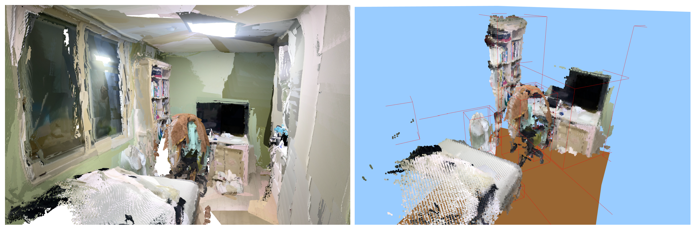
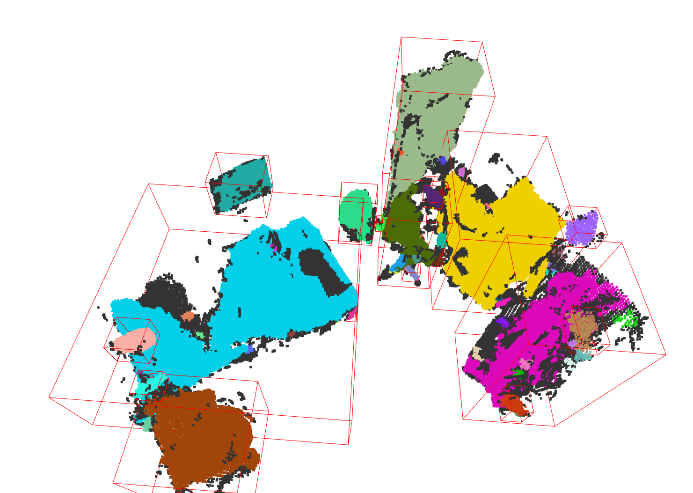

# 3D Indoor Reconstruction

This project focuses on reconstructing indoor 3D space from point cloud data and preparing the scene for object-level editing.

It includes room reconstruction, furniture extraction, and separation of individual furniture objects so that they can be moved and rearranged in external tools such as Blender.

## Overview

The main goal of this project is to reconstruct a clean indoor scene and make the extracted furniture objects editable as independent point cloud objects.

The current workflow includes:

- reconstructing the room structure
- filtering furniture/object point clouds
- detecting furniture regions with bounding boxes
- extracting each furniture object as a separate `.ply` file
- preparing the scene for manual rearrangement

## Pipeline

The overall pipeline is:

1. reconstruct a clean indoor room
2. detect and filter furniture/object regions
3. extract furniture point clouds using bounding boxes
4. save each object separately
5. edit and rearrange objects in Blender

## Results

### Bounding box detection

### Separated furniture objects

### Rearrangement in Blender

## Tools

- Python
- Open3D
- NumPy
- Blender

## Goal

This project aims to combine:

- 3D indoor reconstruction
- object-level point cloud extraction
- interactive furniture rearrangement

so that indoor spaces can be reconstructed and edited more flexibly.

## Notes

Separated furniture objects are exported as individual `.ply` files and can be imported into Blender for direct manipulation.
